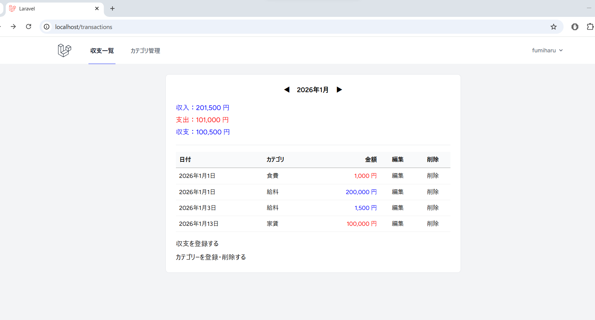
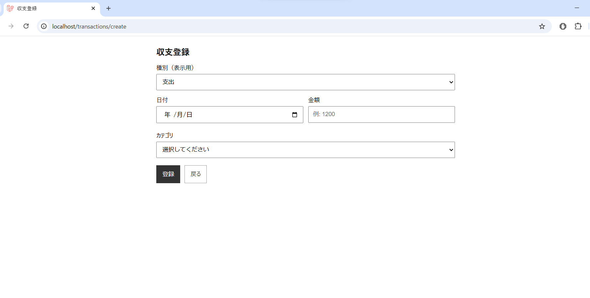
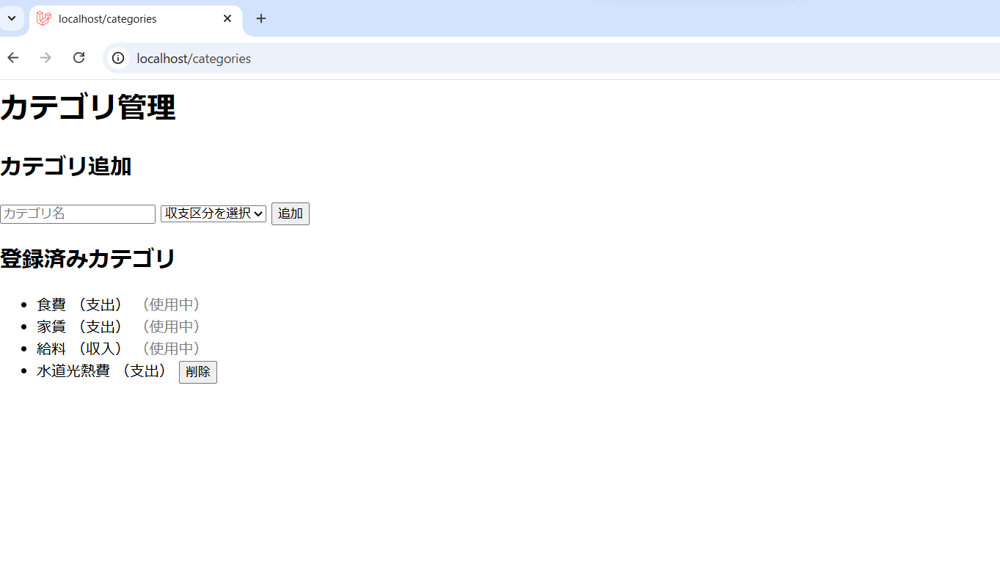

# SimpleLedger

## 概要

**SimpleLedger** は、  
月ごとの収支をシンプルに管理できる家計簿アプリです。

Laravel 学習の成果物として、  
**要件整理 → 画面設計 → テーブル設計 → 実装** を一貫して個人で行いました。

機能を詰め込むのではなく、  
- MVCの責務分離  
- ORM（Eloquent）の理解  
- 業務ルールを意識した実装  

を重視して設計しています。

---

## 主な機能

- ユーザー認証（Laravel Breeze）
- 収支の登録・編集・削除（CRUD）
- 月切り替えによる収支一覧表示
- 月次サマリー（収入・支出・収支）
- カテゴリ管理  
  - 使用中カテゴリは削除不可

---

## 画面構成

### 収支一覧画面
- 月切り替え（前月・翌月）
- 月次サマリー表示
- 取引一覧（カテゴリ・金額・編集・削除）
- 金額は **収入＝青／支出＝赤** で表示

### カテゴリ管理画面
- カテゴリの追加
- 使用中カテゴリの削除制御

---

## 画面イメージ

### 収支一覧（月次サマリー）

### 収支登録

### カテゴリ管理

---

## テーブル設計

実装前に ER 図を作成し、  
テーブル構成とリレーションを整理した上で開発を行いました。  
先に設計を固めることで、実装時に迷いが出ない構成にしています。

### 主なテーブル
- users  
- categories  
- transactions  

### ER 図
dbdiagram.io にて作成  
https://dbdiagram.io/d/simple_ledger-69461ba84bbde0fd74dd13ad

---

## 設計・実装で工夫した点

### 1. 設計を先に固めてから実装
画面構成とER図を先に整理し、  
その設計に沿って実装を進めました。

### 2. MVCの責務を明確化
- Controller：処理の流れ・業務ロジックを管理  
- Model：データ操作（Eloquent）  
- View：表示に専念  

処理が肥大化しないよう、役割分担を意識しています。

### 3. ORM（Eloquent）の理解を重視
`Transaction` と `Category` を  
**belongsTo / hasMany** で定義し、  
SQLのJOINと対応付けて説明できる構成にしています。

### 4. 業務ルールをControllerで制御
「使用中のカテゴリは削除できない」という制約を  
Controller側で判定し、  
UIに依存しない安全な設計にしています。

### 5. UI・可読性の改善
- 画面を中央寄せし、カード型レイアウトを採用  
- 金額は右揃え＋色分け  
- 視線の流れを  
  **月 → サマリー → 明細 → 操作**  
  となるよう調整

---

## 技術スタック

- PHP 8.x  
- Laravel 12.x  
- Laravel Breeze（認証）  
- MySQL  
- Blade  
- Docker（Laravel Sail）  
- Git / GitHub  

---

## 開発環境

- OS：Windows + WSL2  
- 開発環境：Laravel Sail（Docker）  
- エディタ：VS Code  

---

## 今後の改善予定

- フラッシュメッセージの追加
- カテゴリ画面のUI共通化
- 年単位の集計機能

---

## 補足

本アプリは、  
**制約のある時間・環境の中で、設計判断を行いながら完成させること**  
を目的に開発しました。

機能の多さよりも、  
- 設計の一貫性  
- 可読性  
- 自分の言葉で説明できる実装  

を重視しています。
